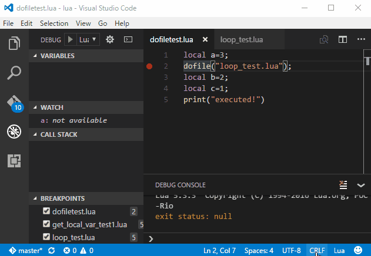

# Lua Remote DeBugger for Visual Studio Code

## Introduction

This extension is debug Lua programs with Visual Studio Code.



## Features

Debug your Lua program.

* Breakpoints
* Step over, step in, step out
* Display Local,Upvalue,Global values
* Watches,Eval on Debug Console
* Debug with embedded Lua interpreter(Lua 5.3.3)
* Remote debugging over TCP network


If you want embedded debug server to your host program, Please see [this page](https://github.com/satoren/LRDB)

## Extension Settings

launch.json example:
```
{
    "version": "0.1.0",
    "configurations": [
        {
            "type": "lua",
            "request": "launch",
            "name": "Lua Launch",
            "program": "${command.CurrentSource}",
            "cwd": "${workspaceRoot}",
            "stopOnEntry": true
        }
    ]
}
```
${command.CurrentSource} is opened at VSCode file.


## Known Issues


## Release Notes

### 0.1.2
Bug fixed

### 0.1.1
Bug fixed

### 0.1.0
Initial release.
